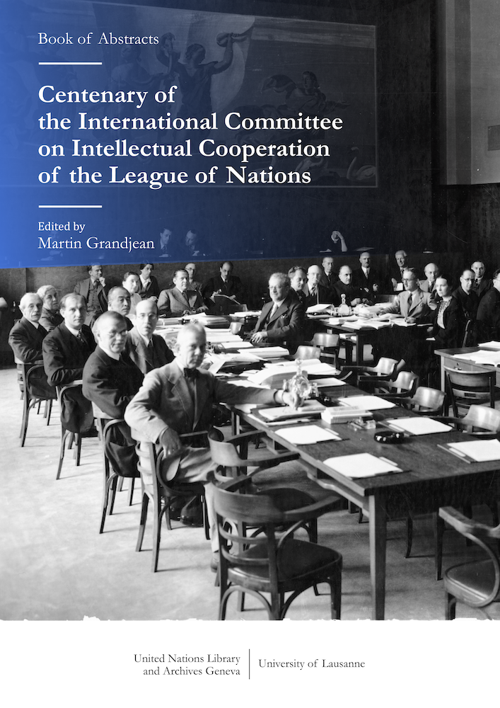

BOOK OF ABSTRACTS

# Centenary of the International Committee on Intellectual Cooperation of the League of Nations

Edited by Martin Grandjean

Published by the United Nations Library and Archives Geneva and the University of Lausanne

<small>Grandjean, M. (ed). _Centenary of the International Committee on Intellectual Cooperation of the League of Nations_. Geneva, 2022, 94 pages.</small>

[Download the full PDF](files/IntellectualCooperation_2022.pdf) or access each paper in the list below.

|  |  | |
| --- | --- | --- |
|  | Table of contents | 3 |
|  | The Centenary of Intellectual Cooperation | 6 |
| Martin Grandjean | [Intellectual Cooperation, a Short Historiographical Overview](/grandjean-2022) | 7-12 |
| Charlotte Faucher | [European cultural diplomacies and the International Committee on Intellectual Cooperation (ICIC)](/faucher-2022) | 13-14 |
| Marilena Papadaki | [N. Politis (1872-1942), a “governments’ intellectual’: the promotion of the idea of intellectual cooperation as a basis for world peace](/papadaki-2022) | 15-16 |
| Pelle Van Dijk | [Mobilising international public opinion: Moral disarmament as the public diplomacy of the League of Nations](/vandijk-2022) |  17-19 |
| Jonathan Voges | [In the engine room of intellectual cooperation. A prosographic approach to the civil servants of the Institut international de coopération intellectuelle in Paris](/voges-2022) | 20-21 |
| Ilaria Scaglia | [A League of Minds with a Heart: Intellectual Cooperation and Emotions in the Interwar Period and Beyond](/scaglia-2022) | 22-23 |
| Johannes Feichtinger | [Central Europe and The Making of Intellectual Cooperation](/feichtinger-2022) | 24-26 |
| Anastassiya Schacht | [Scholars amidst borders: Soviet representation to the League’s Committee on Intellectual Cooperation as an attempt of cross-ideological cooperation in the interwar Europe](/schacht-2022) | 27-29 |
| Monika Šipelytė | [ Gabrielle Radziwill: the story of Eastern European princess at the service of Intellectual Cooperation](/radziwill-2022) | 30-31 |
| Camila Gatica Mizala | [‘Le film, éducateur universel”. The reception of the International Educational Cinematographic Institute in Chile](/gaticamizala-2022) | 32-33 |
| Annamaria Ducci | [The League of Nations and Cultural Heritage. For an intellectual history of a notion](/ducci-2022) | 34-35 |
| Christiane Sibille | [« Les relations internationales au point de vue musical » – Music and Intellectual Cooperation](/sibille-2022) | 36 |
| Leandro Lacquaniti | [The Argentine Commission for Intellectual Cooperation. The itinerary of a cultural diplomacy agency of the Argentine State (1936-1948)](/lacquaniti-2022) | 37-44 |
| Nelva Mildred Hernandez Sosa and Alexandra Pita Gonzalez | [Mexico and the Permanent International Studies Conference. The Sense of the International, 1928-1939](/hernandezsosa-pitagonzalez-2022) | 45 |
| Arnab Dutta | [Towards the Invention of a Common Language of Science: The League of Nations’ Committee for Intellectual Cooperation and the Colonial Question in British India](/dutta-2022) | 46-48 |
| Takashi Saikawa | [Nationalism and Internationalism in Intellectual Co-operation: Aikitsu Tanakadate and the Romanization of Japanese Language](/saikawa-2022) | 49 |
| Jennifer Chang | [Beyond Representation: The Bibliothèque Sino-Internationale and the International Committee on Intellectual Cooperation, 1933-1939](/chang-2022) | 50-51 |
| Emeline Brylinski and Rita Hofstetter | [Education and childhood, a coveted field. The International Bureau of Education, an intergovernmental body seized in its relational network](/brylinski-hofstetter-2022) | 52-54 |
| Kaiyi Li | [Teaching about the League of Nations: An attempt of cultivating international consensus during the interwar period](/li-2022) | 55-56 |
| Xavier Riondet | [How to guide and justify the work of the Intellectual Cooperation on textbooks? About the constitution and the action of the Committee of Experts de 1931](/riondet-2022) | 57-58 |
| Tomás Irish | [‘The League Committee of Intellectual Cooperation (…) has never attracted much sympathy in Great Britain’: Britain and Intellectual Co-operation in the Interwar Period](/irish-2022) | 59-60 |
| Benjamin Martin | [Fascist Cultural Internationalism? Intellectual Cooperation in Mussolini’s Italy, 1925-1937](/martin-2022) | 61-62 |
| Jan Stöckmann | [Academic Refugees and Intellectual Cooperation at the League of Nations](/stockmann-2022) | 63-66 |
| Joyce Goodman | [Laura Dreyfus-Barney (1897-1974), the International Council of Women and International Intellectual Cooperation at Paris, Geneva, and Rome](/goodman-2022) | 67-70 |
| Diana Roig Sanz | [A Global and Gender Perspective to the Historiography of Intellectual Cooperation](/roigsanz-2022) | 71-73 |
| Itzel Toledo Garcia | [Women in International Cooperation during the Interwar Period: the case of Mexican Palma Guillén](/toledogarcia-2022) | 74-75 |
| Elisabet Carbo-Catalan | [Translation activities in the Organization of Intellectual Cooperation](/carbocatalan-2022) | 76-78 |
| Thomas Davies | [Three Approaches to Transnational Intellectual Cooperation: The Entente Committee of the Royal Society of Literature, International PEN, and the Co-ordinating Committee of the Major International Associations, 1916-1939](/davies-2022) | 79-80 |
|  | Bibliography | 81-89 |
|  | Conference program | 90-93 |
|  | Credits | 94 |

<iframe src="files/IntellectualCooperation_2022.pdf" width="620px" height="700px">

  
  
