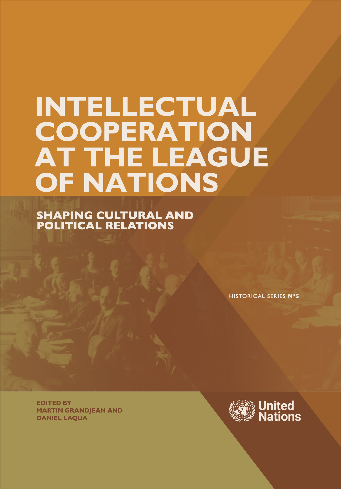

EDITED VOLUME ON INTELLECTUAL COOPERATION

# Intellectual Cooperation at the League of Nations
## Shaping Cultural and Political Relations

 

Edited by Martin Grandjean and Daniel Laqua

United Nations Historical Series N°5

<small>Grandjean, M. and Laqua D. (eds). _Intellectual Cooperation at the League of Nations: Shaping Cultural and Political Relations_. UN Historical Series. Geneva: United Nations, 2025, 233 pages.</small>

Links to the printed and PDF versions

